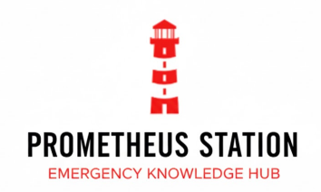

<div align="center">



# 
### 🔥 A lighthouse when everything burns

</div>

---

## The vision

When civilization's infrastructure collapses—whether by earthquake, war, censorship, or chaos—knowledge becomes the foundation for survival and rebuilding.

**Prometheus Station is a seed vault for human knowledge.**

A solar-powered, self-sufficient knowledge hub that works when the internet doesn't. When cell towers are rubble. When libraries are ash. When asking Google isn't an option.

This is more than emergency medicine. It's the collective wisdom needed to rebuild: how to purify water, grow food, generate power, treat illness, educate children, and maintain the thin veneer we call civilization.

**No internet. No monthly fees. No dependency on infrastructure that can fail.**

Just the accumulated knowledge of humanity, ready to restart civilization from scratch if needed.

---

## What this actually is

Three critical systems in one portable, resilient package:

### 📚 An offline knowledge repository
- Complete Wikipedia (90GB+ in English alone) - Human knowledge, uncensored
- Essential technical skills (engineering, agriculture, construction, energy)
- Medical protocols (emergency medicine, public health, disease prevention)
- Survival fundamentals (water, food, shelter, sanitation, first aid)
- Educational resources (mathematics, sciences, languages, history)
- Access via WiFi hotspot - connect like any network, no internet needed

### 📡 Long-range mesh communication
- LoRa radio network for text messaging
- Range: 1-15km+ depending on terrain
- Works when cell towers don't
- Messages hop through other stations (mesh networking)
- No carrier. No bills. No permission needed.

### ☀️ Energy independence
- Solar-powered with battery backup
- Runs indefinitely without grid power
- Portable or fixed installation
- Operates in disaster zones, remote areas, anywhere with sun

**In practice:** You deploy a backpack-sized station. It creates a WiFi bubble containing the essential knowledge to sustain civilization. People connect with phones, tablets, laptops. No internet required. Knowledge flows. Communities rebuild. Civilization persists.

---

## Why this exists

### The problem

Modern civilization stores its knowledge in the cloud. Wikipedia, textbooks, technical manuals, medical references—all require functioning infrastructure.

**When the grid fails, we lose access to everything we know.**

A doctor in a disaster zone can't look up treatment protocols. Engineers can't reference specifications. Teachers have no materials. Communities lose the technical knowledge needed to maintain water systems, generate power, or grow food efficiently.

### The solution

Decentralize critical knowledge. Make it resilient. Make it accessible. Make it work when everything else fails.

**Prometheus gave humanity fire. This station preserves the knowledge to use it—and everything else we've learned since.**

### Who this serves

- 🏚️ **Post-disaster communities** - Rebuilding infrastructure, restoring services
- 🏥 **Remote medical facilities** - Healthcare without internet connectivity
- 🌍 **Humanitarian operations** - MSF, ICRC, Red Cross field missions
- 📚 **Censored regions** - Access to uncensored human knowledge
- 🏔️ **Off-grid settlements** - Education and technical references
- 🔬 **Remote operations** - Field research, mining, exploration
- 🛡️ **Resilience planners** - Community self-sufficiency preparation
- 🎓 **Educators** - Teaching in areas with unreliable connectivity
- 🏗️ **Development projects** - Building infrastructure in remote areas

**Real-world scenarios this system addresses:**
- 2010 Haiti earthquake - Infrastructure destroyed, technical knowledge needed for rebuilding
- 2013 Typhoon Haiyan - Power grid down, water systems failed, no access to repair manuals
- Syrian conflict zones - Censored internet, isolated communities needing to maintain services
- Remote settlements - Zero connectivity, need technical references for infrastructure
- Refugee camps - Educational resources non-existent, children growing up without schooling
- Grid failures - Extended power outages eliminating access to online resources

---

## 🎯 What's inside

### Knowledge content (choose your strategy)

**Strategy 1: Crisis response pack (~5.5 GB)**
- Emergency medical protocols (WHO, MSF, ICRC field guides)
- Water purification and sanitation (critical infrastructure)
- Food safety and emergency nutrition
- Shelter and emergency construction
- Basic electrical and mechanical repair
- Wikipedia subsets: medicine, engineering, agriculture (EN + FR)
- **Best for:** Disaster response, rapid deployment, humanitarian missions

**Strategy 2: Civilization rebuild kit (~120-150 GB)**
- Complete Wikipedia (English + French) - All human knowledge
- All critical content from Strategy 1
- Technical references (engineering, agriculture, construction, energy)
- Educational curriculum (K-12 mathematics, sciences, literature)
- Historical and cultural knowledge
- **Best for:** Long-term installations, community centers, educational hubs

**Strategy 3: Survival essentials (~750 MB)**
- Critical medical protocols (life-threatening emergencies)
- Water purification methods
- Basic shelter and fire
- Emergency food safety
- **Best for:** Ultra-portable, rapid response, proof-of-concept

See [Content strategy guide](docs/02-kiwix-installation.md) for details.

### Hardware components

**Computing:**
- Raspberry Pi 4 (8GB RAM) - The brain
- 256GB microSD A2 class - Fast storage for large databases
- E-Ink display - Low-power status monitoring

**Communication:**
- LILYGO T-Beam LORA32 868MHz - Long-range radio gateway
- T-Echo handheld terminals - Mobile mesh nodes
- Omnidirectional antenna - 360° coverage

**Power:**
- 30W foldable solar panel - Energy harvesting
- 24,000mAh battery bank - Multi-day autonomy
- 18650 batteries for portables - Extended operation

**Infrastructure:**
- 7m telescopic mast - Extended range deployment
- Weatherproof cabling - Field durability

**Total cost:** ~400-500€ (components list: [HARDWARE.md](HARDWARE.md))

---

## 🚀 Build your own

This repository contains **complete, tested, beginner-friendly documentation** for building Prometheus Station from scratch.

**Documentation philosophy:**
- Written by a beginner, for beginners
- Every step explained, no assumed knowledge
- Real-world tested on actual hardware
- Troubleshooting based on actual problems encountered
- No marketing fluff - just what works

### Setup guides (complete & tested)

**✅ [Step 1: Raspberry pi setup](docs/01-raspberry-setup.md)**
- Headless configuration (no monitor needed)
- SSH access with key authentication
- System optimization for 24/7 operation
- **Time:** 1h 45min | **Difficulty:** ⭐⭐☆☆☆ Easy

**✅ [Step 2: Kiwix installation](docs/02-kiwix-installation.md)**
- Content strategy selection
- ZIM file downloads (Wikipedia, medical content)
- Server configuration and optimization
- **Time:** 2-4 hours (mostly downloads) | **Difficulty:** ⭐⭐☆☆☆ Medium

**✅ [Step 3: Kiwix configuration](docs/03-kiwix-configuration.md)**
- Advanced server configuration
- Performance optimization
- Content management
- **Time:** 1-2 hours | **Difficulty:** ⭐⭐☆☆☆ Medium

**✅ [Step 4: Wifi access point](docs/04-wifi-access-point.md)**
- Transform Pi into wireless hotspot
- Captive portal configuration
- Network setup and optimization
- **Time:** 1-2 hours | **Difficulty:** ⭐⭐⭐☆☆ Medium

**✅ [Step 5: System maintenance & updates](docs/05-maintenance-updates.md)**
- Health monitoring dashboard
- Automated update procedures
- Content management and rotation
- **Time:** 2 hours initial + 30-45 min/month | **Difficulty:** ⭐⭐⭐☆☆ Medium

**⏳ [Step 6: Meshtastic setup](docs/06-meshtastic-setup.md)**
- LoRa radio configuration
- Mesh network deployment
- Mobile terminal setup
- **Status:** Planned

**⏳ [Step 7: Solar power](docs/07-solar-power.md)**
- Power system wiring
- Energy monitoring
- Autonomy optimization
- **Status:** Planned

### Quick start

1. **Get hardware** - See [HARDWARE.md](HARDWARE.md) for complete list (~500€)
2. **Follow guides** - Start with [Step 1](docs/01-raspberry-setup.md)
3. **Choose content** - Select strategy based on your mission
4. **Deploy** - Field test, iterate, improve

**Estimated build time:**
- First build: ~8-12 hours (spread over weekend)
- Hardware assembly: ~2 hours
- Software setup: ~4 hours
- Content download: 2-6 hours (depends on strategy)

---

## 🧠 The philosophy

### Why "Prometheus"?

> **Prometheus stole fire from the gods and gave it to humanity.**
>
> We're stealing knowledge from the cloud and giving it to everyone, everywhere—even when the world burns.

### Core principles

**Resilience**
- Works when infrastructure fails
- No single point of failure
- Offline-first design
- Solar-powered autonomy

**Accessibility**
- No internet required
- No monthly fees
- No proprietary software
- No permission needed

**Open**
- Fully open-source
- Complete documentation
- Reproducible builds
- Community-driven improvement

**Ethical**
- Knowledge should be free and accessible to all
- Privacy by design (no tracking, no data collection)
- Humanitarian and educational focus
- Information for survival, rebuilding, and flourishing

**Practical**
- Real hardware, real testing
- Field-deployable
- Beginner-friendly documentation
- Cost-effective (~500€)

---

## 🌍 Real-world impact

**Designed for when infrastructure fails and knowledge becomes survival:**

**Crisis scenarios:**
- Natural disasters - Earthquakes, tsunamis, hurricanes destroying local infrastructure
- Conflict zones - War-torn areas with destroyed libraries, schools, hospitals
- Grid failures - Extended power outages eliminating internet access
- Censorship - Regions where access to information is restricted or monitored

**Rebuilding scenarios:**
- Post-disaster reconstruction - Engineers need specs, builders need plans
- Water system restoration - Communities need purification and distribution knowledge
- Educational continuity - Teachers and students need curriculum materials
- Medical capability - Healthcare workers need protocols and references
- Agricultural recovery - Farmers need information on crops, soil, irrigation

**Long-term resilience:**
- Remote settlements - Off-grid communities maintaining civilization
- Refugee camps - Displaced populations educating next generation
- Indigenous preservation - Communities documenting and sharing traditional knowledge
- Preparedness planning - Municipalities building resilient information infrastructure

**If you deploy this in the field, we want to hear about it.** Your experience shapes future versions and helps communities worldwide.

---

## 🛠️ Technical overview

**System architecture:**
```
┌─────────────────────────────────────────┐
│          PROMETHEUS STATION             │
│                                         │
│  ┌──────────┐        ┌──────────┐     │
│  │  Solar   │───────▶│ Battery  │     │
│  │  Panel   │        │  Bank    │     │
│  └──────────┘        └────┬─────┘     │
│                           │            │
│                           ▼            │
│              ┌─────────────────┐       │
│              │  Raspberry Pi   │       │
│              │  (The Brain)    │       │
│              │                 │       │
│              │ • Kiwix Server  │       │
│              │ • WiFi Hotspot  │       │
│              │ • Mesh Gateway  │       │
│              └────────┬────────┘       │
│                       │                │
│         ┏━━━━━━━━━━━━━┻━━━━━━━━━━━━┓   │
│         ▼                          ▼   │
│  ┌─────────────┐          ┌──────────┐│
│  │   WiFi      │          │   LoRa   ││
│  │   Radio     │          │   Radio  ││
│  │ (300m max)  │          │ (15km+)  ││
│  └─────────────┘          └──────────┘│
│         │                      │      │
└─────────┼──────────────────────┼──────┘
          │                      │
          ▼                      ▼
    [Phones/Laptops]      [Mesh Network]
    Access Wikipedia      Long-range comms
```

**Power budget:**
- Solar input: 15-25W (daytime average)
- System draw: 4-6W (continuous)
- Battery capacity: 89Wh
- Runtime: 18+ hours without sun
- Autonomy: Indefinite with 4+ hours sunlight/day

**Network capabilities:**
- WiFi: 50-300m range (local knowledge access)
- LoRa: 1-15km+ range (mesh communication)
- Concurrent users: 10-20 (WiFi), unlimited (LoRa mesh)
- Content size: 5.5GB to 150GB (strategy dependent)

---

## 📋 Project status

**Completed:**
- ✅ Hardware selection and testing
- ✅ Raspberry Pi setup guide (tested, documented)
- ✅ Kiwix installation guide (tested, documented)
- ✅ Kiwix configuration guide (tested, documented)
- ✅ WiFi access point configuration (tested, documented)
- ✅ System maintenance & updates guide (tested, documented)
- ✅ Content strategy framework
- ✅ Power consumption analysis
- ✅ Beginner-friendly documentation

**In progress:**
- ⏳ Meshtastic LoRa integration
- ⏳ Solar power system assembly
- ⏳ Field testing

**Planned:**
- 📋 Custom landing page UI
- 📋 E-Ink status display integration
- 📋 Multi-language support
- 📋 Remote management tools
- 📋 Deployment case design

**Timeline:** No deadlines. This is built right, not fast.

---

## 🤝 Contributing

**This project needs:**
- Field testing reports (critical!)
- Medical content recommendations
- Hardware alternatives for different budgets
- Translation of documentation
- Power optimization discoveries
- Antenna configuration improvements
- Real-world deployment feedback

**How to contribute:**
1. **Field experience** - Deploy and document your learnings
2. **Technical improvements** - Better configs, optimizations
3. **Documentation** - Fix errors, clarify confusing sections
4. **Content curation** - Recommend additional ZIM files
5. **Translations** - Help reach more people

Open an issue or pull request. All knowledge shared makes this better.

---

## 🏥 Medical disclaimer

**Critical notice:**

Medical content provided by Prometheus Station is for **reference and educational purposes only**.

- ✅ Use for field reference when professional care unavailable
- ✅ Training and education for medics and first responders
- ✅ Emergency preparedness planning
- ❌ NOT for self-diagnosis or self-treatment
- ❌ NOT a replacement for qualified medical professionals

**In emergencies:** Seek professional medical help when available. This system is a lifeline when nothing else exists, not a replacement for proper medical care.

Content sources: WHO, MSF, ICRC field guidelines. Verify critical information from multiple sources.

---

## 📜 License

**MIT License** - See [LICENSE](LICENSE)

Copyright © 2025 Guillain Mejane

**What this means:**
- ✅ Use freely for any purpose
- ✅ Modify and adapt to your needs
- ✅ Deploy in disaster zones without asking
- ✅ Build commercial products (though why?)
- ✅ Share and distribute
- ❌ Don't blame me if it achieves sentience

**Special grant to humanitarian organizations:**

MSF, ICRC, Red Cross, and all humanitarian organizations: You have explicit permission to use, modify, and deploy this system **without attribution requirements**. Save lives first. Credit never.

---

## 🙏 Standing on shoulders of giants

**This exists because of:**

- **[Kiwix](https://www.kiwix.org)** - Making offline knowledge possible
- **[Meshtastic](https://meshtastic.org)** - Resilient mesh communication
- **[Raspberry Pi Foundation](https://www.raspberrypi.org)** - Accessible computing
- **Wikipedia contributors** - Humanity's knowledge, freely shared
- **WHO, MSF, ICRC** - Medical protocols that save lives
- **Open-source community** - Collective brilliance
- **Emergency responders worldwide** - Inspiration and purpose

---

## 📞 Contact & community

- **GitHub:** [@GuillainM](https://github.com/GuillainM)
- **Issues:** [Report problems or suggest improvements](https://github.com/GuillainM/Prometheus-Station/issues)
- **Discussions:** [Share your deployment stories](https://github.com/GuillainM/Prometheus-Station/discussions)

**If you build this, share your experience.** Every deployment teaches us something.

---

<div align="center">

## 🔥 The fire we carry 🔥

In a world where knowledge is centralized, connectivity is fragile, and infrastructure can vanish overnight...

**We choose resilience.**

We build systems that work when nothing else does.
We preserve knowledge that cannot be extinguished.
We light beacons in the darkness.

**Prometheus Station is a lighthouse when everything burns.**

---

### If you believe knowledge should survive anything, star this repo.

**Built with fire and coffee by someone who had no idea what they were doing.**
**Documented for anyone who wants to learn.**

**Deploy. Share. Preserve. Endure.**

</div>

---

*Last updated: December 2025*
*Status: Tested, documented, ready to build*
*Hardware verified: Raspberry Pi 4, tested in real-world conditions*
